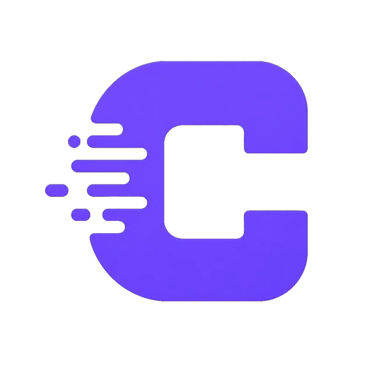
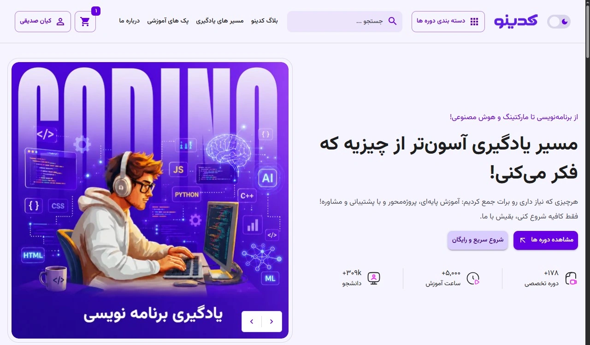
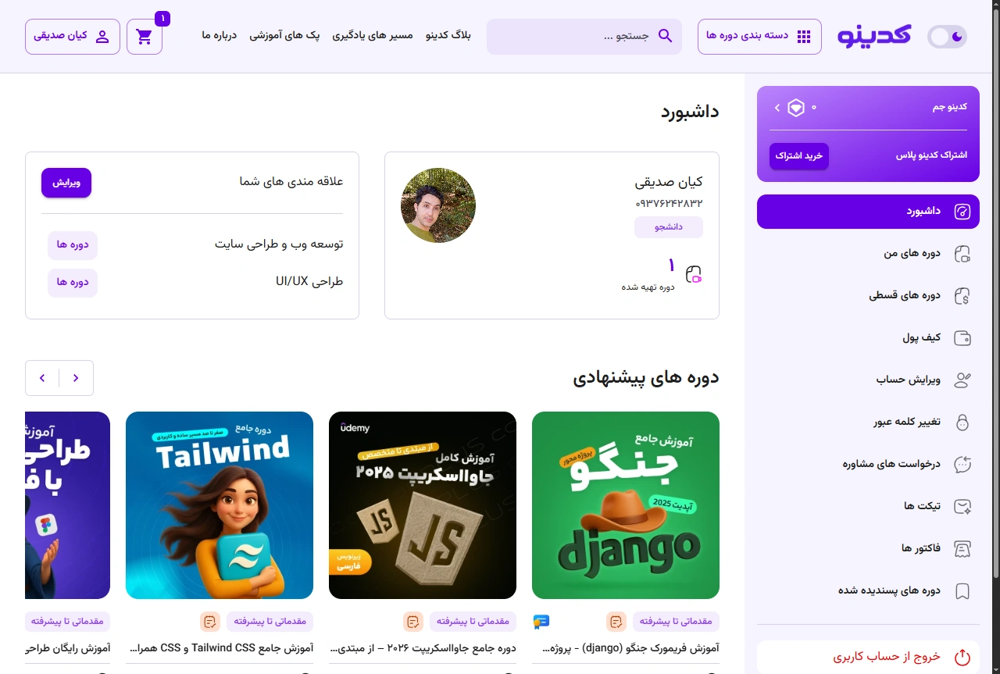
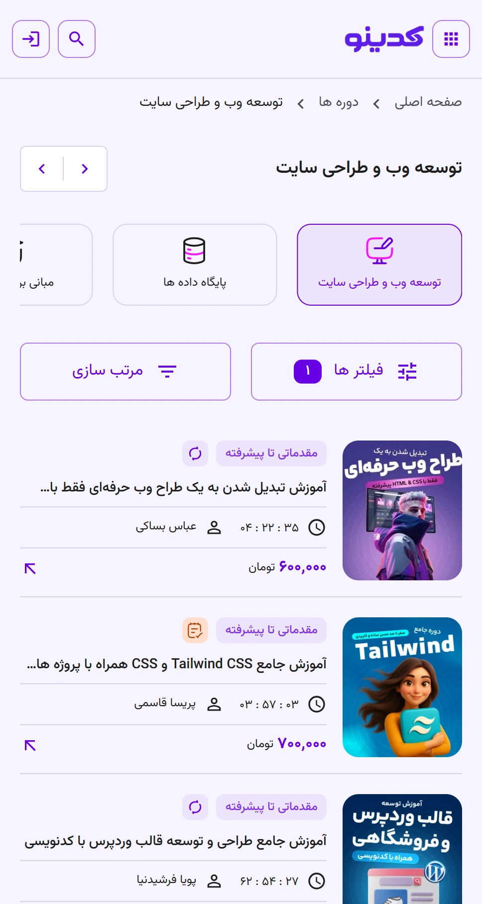

<h1>
  
  Codino
  
</h1>

  

> پروژه کدینو با هدف ایجاد یک نمونه‌کار برای تمرین و نمایش مهارت‌های توسعه فرانت‌اند و استفاده از تکنولوژی‌های ذکرشده در این پروژه ساخته شده و در بخش Live Demo به‌صورت آنلاین در دسترس است.

  
  
  
  

## 🎯 Features

- 🔐 Authentication & user account
- 🔑 Login / Register / OTP verification
- 👤 User profile
- 🎓 My Courses
- 🛒 Shopping cart
- ❤️ Wishlist
- 🏷️ Dynamic filters
- 🌙 Dark / Light theme
- 💳 Payment method UI
- 📱 Fully responsive design

## 🛠️ Tech Stack

- React
- Material UI
- Redux Toolkit
- React Router
- Supabase
- React Hook Form
- Zod
- Swiper

## 🗄️ Backend & Database

Codino uses Supabase for:

- Authentication
- PostgreSQL database
- Storage
- Row Level Security (RLS)

## 🧠 What I Learned

This project helped me practice:

- React architecture
- Redux state management
- Authentication flows
- Supabase integration
- Responsive UI development
- Accessibility
- Performance optimization
- Component reusability

## 📸 Screenshots

